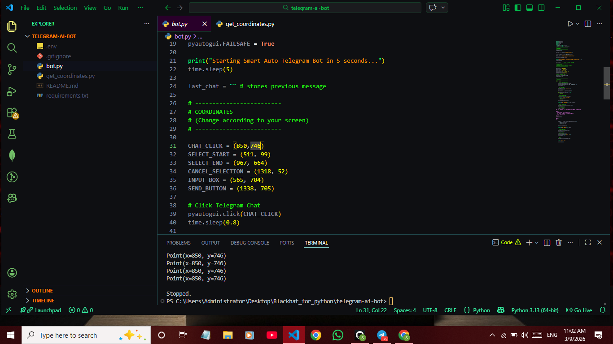
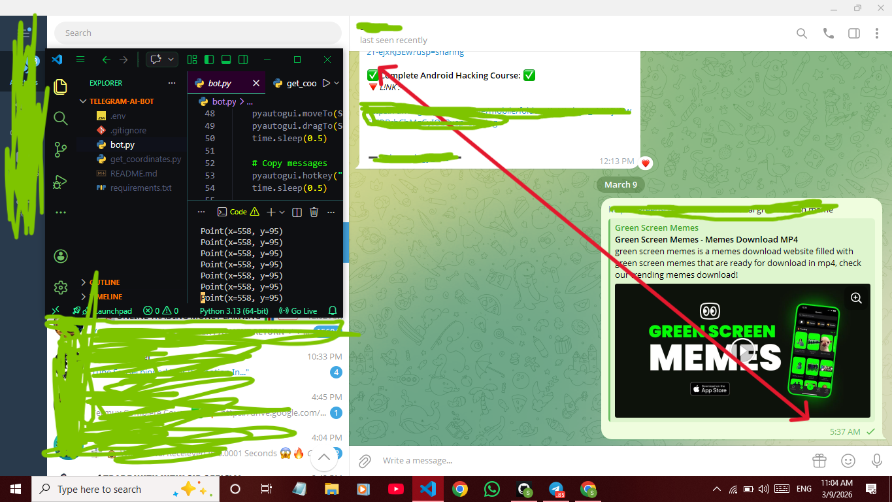

# 🤖 Smart Auto Telegram AI Bot

An automated Telegram bot that reads chat messages from the screen and replies using **Google Gemini AI**.
The bot simulates a **real human conversation style** and automatically responds to new messages.

⚠️ This project uses **screen automation**, so coordinates must be configured for your system.

---

# 🚀 Features

• Automatic Telegram message detection
• AI replies using Gemini Flash model
• Human-like Hinglish conversations
• Prevents duplicate replies
• Fully customizable screen coordinates
• Works with Telegram Desktop

---

# 🧠 How It Works

1. Bot selects Telegram chat messages
2. Copies chat history
3. Sends it to Gemini AI
4. Generates reply
5. Pastes and sends reply automatically

---

# 📦 Installation

Clone the repository

```
git clone https://github.com/sujal872/telegram-ai-bot.git
cd telegram-ai-bot
```

Install dependencies

```
pip install -r requirements.txt
```

---

# 🔑 Setup Gemini API Key

Create `.env` file

```
GEMINI_API_KEY=YOUR_API_KEY
```

---

# 🖱️ Find Screen Coordinates

Run the coordinate finder script: 

```
python get_coordinates.py
```

Move your mouse to important Telegram UI elements:

• Chat window
• Message selection area
• Input box
• Send button

Update these values in `bot.py`.

---



---
###  This image shows the screen coordinates used by the automation script to select messages and send replies. 

---




# ▶️ Run the Bot

```
python bot.py
```

Bot will start in **5 seconds**.

Make sure Telegram Desktop is open.

---

# ⚠️ Important Notes

• Works best with **Telegram Desktop**
• Screen resolution affects coordinates
• Keep Telegram window in the same position

---

# 🛠 Tech Stack

Python
PyAutoGUI
Pyperclip
Google Gemini AI

---

# 📌 Disclaimer

This project is for **educational purposes only**.
Use responsibly and respect platform policies.

---

## 👨‍💻 Author

Sujal Karnwal
Cybersecurity Enthusiast | Python Learner  

---

# ⭐ Support

If you like this project, consider giving it a ⭐ on GitHub.
